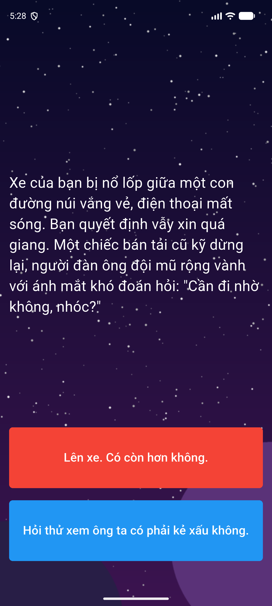

# Lab 7: Destini

Truyện tương tác dạng "chọn lối đi".

## Chức năng

- Class `Story` lưu đoạn truyện và `nextStory1`, `nextStory2`.
- Class `StoryBrain` xử lý điều hướng giữa các đoạn trong `_storyData`.
- `Visibility` ẩn nút thứ hai khi tới đoạn kết, chỉ còn nút **Bắt đầu lại**.
- Hình nền `images/background.png`.

## Cấu trúc chính

- `lib/main.dart`
- `lib/story.dart`
- `lib/story_brain.dart`

## Chạy ứng dụng

```bash
flutter pub get
flutter run
```

## Demo


